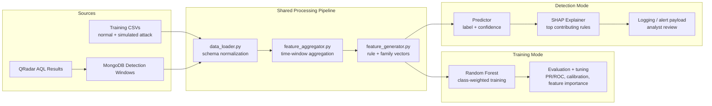
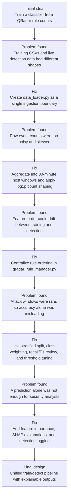

# AIDetection

**I built a supervised threat-detection pipeline that turns QRadar rule telemetry into explainable host-level attack signals.**

AIDetection is one of my AI Engineering portfolio projects. I designed it as an end-to-end machine learning system, not as a notebook-only experiment: it covers data ingestion, schema normalization, feature engineering, Random Forest training, hyperparameter tuning, detection-time inference, SHAP-style explanations, and operational logging.

> **Data boundary:** the original QRadar and Picus BAS datasets were handled inside an internal regulated environment and cannot be exported. This public repository uses sanitized/test data and representative artifacts so I can demonstrate the engineering workflow without exposing internal security telemetry.

## Why I Built This

Security ML systems are easy to overfit offline and hard to trust in production. The key risk I wanted to solve was training-serving skew: a model that performs well on prepared CSVs but sees a different feature pipeline during live detection.

My design principle was:

> I use the same data-processing and feature-engineering path for both training and detection.

Training CSVs and MongoDB-backed detection windows are normalized early, then passed through the same aggregation and feature-vector generation modules before either model training or inference.

## Project Snapshot

| Area | What I Implemented |
| --- | --- |
| Problem | Binary detection of simulated attack behavior from QRadar rule activity |
| Data source | Internal QRadar/Picus telemetry in the original environment; sanitized/test data in this repo |
| Feature scale | Rule-level QRadar trigger features, with support for broader feature-family signals |
| Model | Random Forest classifier for sparse tabular security telemetry |
| Optimization | Stratified split, class weighting, hyperparameter search, threshold tuning, and false-positive review |
| Explainability | Feature importance and SHAP top-rule explanations for suspicious predictions |
| Operations | QRadar AQL jobs, MongoDB persistence, daily logs, detection thresholding, and analyst-facing outputs |
| Main engineering goal | A reusable training/detection pipeline that reduces drift between offline ML work and operational inference |

## Architecture



## What I Focused On

| Engineering Area | My Approach |
| --- | --- |
| Data normalization | I unified CSV and MongoDB inputs into `hostname`, `rule_id`, `timestamp`, `count`, and `source_label` |
| Timestamp handling | I centralized QRadar timestamp parsing and 30-minute window assignment |
| Rule mapping | I kept rule ordering stable so training features and detection features line up |
| Aggregation | I converted raw rule triggers into host-level time windows with sparse rule dictionaries |
| Count shaping | I applied `log1p` before aggregation to reduce skew from high-volume rules |
| Feature generation | I converted sparse rule dictionaries into deterministic dense vectors |
| Model selection | I used Random Forest because it performs well on tabular data, trains quickly, and exposes feature importance |
| Class imbalance | I used stratified splitting and class weighting because attack windows are rare |
| Threshold tuning | I treated the detection threshold as an operational decision, balancing missed attacks against analyst workload |
| Error analysis | I reviewed false positives, feature importance, PR/ROC artifacts, calibration, lift/gains charts, and local explanations |

## Improvement Journey

I built this project iteratively. I did not start with the final architecture. The most important work was turning an early model-training idea into a reusable ML system that could support both offline training and live detection.



## Key Improvements I Made

| Improvement | Why I Made It | What Changed |
| --- | --- | --- |
| Unified ingestion | I wanted to avoid separate logic for training CSVs and live MongoDB detection data | I moved source-specific parsing into `pipeline/data_loader.py` and standardized the downstream schema |
| Shared feature pipeline | I wanted the model to see the same feature logic during training and detection | I routed both modes through `data_loader.py`, `feature_aggregator.py`, and `feature_generator.py` |
| Time-window aggregation | Raw rule events were too granular for a host-level detector | I aggregated events into 30-minute windows keyed by hostname and rule activity |
| Stable rule mapping | Feature vectors become invalid if rule order changes between train and detect | I centralized rule-list loading and index mapping in `shared_utils/qradar_rule_manager.py` |
| Count transformation | High-frequency rules can dominate sparse tabular models | I applied `log1p` before aggregation so large counts still matter without overwhelming other signals |
| Imbalance-aware training | Attack windows are much rarer than normal windows | I used stratified splitting and class-weighted Random Forest training |
| Threshold tuning | The best probability cutoff is an operations decision, not just a model default | I separated model training from alert-threshold selection |
| Explainability layer | Security analysts need to know why a window was flagged | I added feature importance and SHAP-style top-rule explanations for suspicious windows |
| Operational logging | A useful detector needs traceable outputs, not only printed predictions | I added structured logging for predictions, confidence, host/window identifiers, and top contributing rules |

## Mistakes, Fixes, and Lessons

I keep this section in the README because it shows the engineering reasoning behind the final design. I do not expose internal numbers, but I do show the problems I found and how I corrected them.

| Issue I Ran Into | Why It Was a Problem | Correct Fix |
| --- | --- | --- |
| Treating training and detection as separate scripts | This creates training-serving skew and makes live predictions hard to trust | I replaced separate flows with a unified orchestrator in `pipeline/main_pipeline.py` |
| Parsing timestamps close to where they were used | Different modules could interpret QRadar timestamps differently | I centralized parsing and window assignment in `shared_utils/time_utils.py` |
| Building feature vectors directly from whatever rules appeared in a batch | Missing or reordered rules would shift columns and corrupt model input | I used a fixed ordered rule universe and generated deterministic dense vectors |
| Looking at accuracy as the main metric | With rare attacks, high accuracy can hide missed detections | I focused on confusion matrix, recall, F1, ROC/PR review, and threshold behavior |
| Letting large rule counts pass through directly | A few very active rules could dominate the model | I added `log1p` count shaping before aggregation |
| Returning only a malicious/benign label | Analysts need evidence to review and trust an alert | I added feature importance and local explanation output |
| Keeping too much logic in one pipeline controller | It made testing and maintenance harder | I split the system into ingestion, aggregation, feature generation, training, prediction, explanation, and logging modules |

## Wrong vs. Correct Approach

| Area | Wrong Approach | What I Did Instead |
| --- | --- | --- |
| Data pipeline | Build one script for training and another script for detection | Use one shared processing path for both modes |
| Feature layout | Let each dataset define its own feature columns | Use a fixed rule list and deterministic rule-to-index mapping |
| Model metric | Optimize for overall accuracy | Review attack-class recall, false positives, F1, and threshold tradeoffs |
| Alerting | Emit a binary result only | Include confidence, host/window context, and top contributing rules |
| Security data | Publish raw telemetry or internal metrics | Keep data private and publish only architecture, workflow, and sanitized examples |

## Repository Layout

```text
AIDetection/
├── pipeline/
│   ├── data_loader.py          # CSV/MongoDB ingestion and schema normalization
│   ├── feature_aggregator.py   # Time-window aggregation and count shaping
│   ├── feature_generator.py    # Rule/family vector generation
│   ├── main_pipeline.py        # Unified train/detect orchestrator
│   └── config.json             # Local pipeline configuration
├── model_training/
│   ├── model_training.py       # Random Forest training, tuning, evaluation artifacts
│   ├── model_evaluation.py     # Standalone model evaluation helpers
│   └── tsne_visualizer.py      # Diagnostic visualization utilities
├── system/
│   ├── shap_explainer.py       # SHAP explanation workflow
│   └── logging_utils.py        # Daily logs and detection logging helpers
├── mongodb/                    # MongoDB connection, insertion, cleanup utilities
├── api_integration/            # QRadar search create/status/result/delete jobs
├── shared_utils/               # Rule manager and time utilities
├── Training_data/              # Public test/sanitized CSV examples
├── model/                      # Representative generated artifacts
├── tests/                      # Pipeline and module tests
├── Makefile                    # venv-enforced install/test commands
└── requirements.txt            # Python 3.6.8-compatible dependencies
```

## Core Implementation

### `pipeline/data_loader.py`

I use this module as the ingestion boundary for both training and detection.

- In `train` mode, it reads normal and attack CSVs from `Training_data/`.
- In `detect` mode, it queries MongoDB through `mongodb/mongodb_connection.py`.
- It parses QRadar timestamps through `shared_utils/time_utils.py`.
- It coerces rule IDs, counts, hostnames, and missing values into a consistent schema.

### `pipeline/feature_aggregator.py`

I use this module to turn raw rule-trigger events into model windows.

- It groups events by time window, hostname, source label, and source IP.
- It creates `aggregated_rules` dictionaries and keeps `aggregated_rules_dict` as a compatibility alias.
- It computes total events, unique rule counts, and window boundaries.
- It applies `log1p` count shaping before vectorization.

### `pipeline/feature_generator.py`

I use this module to convert sparse aggregated rules into model-ready vectors.

- It pulls deterministic rule ordering from `shared_utils/qradar_rule_manager.py`.
- It supports rule-level and family-level feature representations.
- It keeps feature layout stable between training and detection.
- It returns `X` and `y` for training, and `X` for detection.

### `model_training/model_training.py`

I use this module to train and tune the Random Forest detector.

- It performs stratified train/test splitting.
- It supports class-weighted Random Forest training.
- It supports configurable `GridSearchCV` and `RandomizedSearchCV`.
- It writes evaluation artifacts, diagnostic charts, and feature-importance outputs.

### `model_predictor.py` and `system/shap_explainer.py`

I use these modules for operational inference and explanation.

- The predictor loads the persisted model artifact.
- It returns prediction labels and positive-class probabilities.
- The explainer generates top contributing rules for suspicious windows.
- The logging layer prepares analyst-facing detection records.

## Quick Start

This project is pinned to a local virtual environment. The Makefile is intentionally wired to `venv`.

```bash
make install
source venv/bin/activate
```

Run training:

```bash
python -m pipeline.main_pipeline train --config pipeline/config.json
```

Run detection:

```bash
python -m pipeline.main_pipeline detect --config pipeline/config.json
```

Run the focused test suite:

```bash
make test
```

## Configuration Notes

- Python target: `3.6.8`
- Core model: `sklearn.ensemble.RandomForestClassifier`
- Feature mode is configurable through `pipeline/config.json`
- Detection threshold is configurable and should be tuned with analyst workload in mind
- QRadar tokens, internal hosts, and live credentials should never be committed to a public repository

## What This Shows Recruiters

This project is meant to show how I think as an AI Engineer working with real operational data constraints:

- I can translate a security monitoring problem into a supervised ML objective.
- I can build a reusable feature pipeline instead of one-off training scripts.
- I understand training-serving skew and design against it.
- I can engineer sparse tabular features from event telemetry.
- I can handle rare positive classes with appropriate splitting, weighting, and thresholding.
- I can make model output explainable enough for analyst review.
- I can connect ML code to operational components such as QRadar jobs, MongoDB, logging, and alerts.
- I can document sensitive-data boundaries clearly without exposing private telemetry.

## Limitations

- The public data is sanitized/test-only and does not represent the full internal environment.
- Internal performance metrics are intentionally not published.
- Checked-in artifacts are workflow evidence, not production benchmarks.
- Production use would require controlled validation, analyst review, credential management, monitoring, and environment-specific deployment hardening.

## Security Notice

This repository is for defensive security analytics. I used simulated attack data from a trusted BAS workflow to build detection logic for internal monitoring. Real QRadar exports, MongoDB dumps, and model artifacts derived from internal telemetry should be treated as sensitive.
