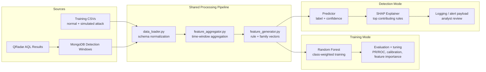

# AIDetection

**Supervised threat detection from QRadar rule telemetry.**

AIDetection is an end-to-end machine learning pipeline for turning QRadar rule trigger frequencies into host-level threat detections. The project is built as an AI Engineering system, not a notebook experiment: it covers ingestion, schema normalization, feature engineering, model training, hyperparameter tuning, detection-time inference, SHAP explanations, and operational logging.

> **Data boundary:** the real QRadar/Picus datasets and evaluation results were handled inside an internal regulated environment and cannot be exported. This public repository uses test/sanitized data and representative artifacts to show the engineering workflow without exposing internal security telemetry.

## Why This Project Matters

Security ML fails when offline training and live detection drift apart. This project is designed around one core principle:

> Use the same data processing and feature engineering path for training and detection.

That means CSV-based training data and MongoDB-backed detection windows are normalized early, then passed through the same aggregation and feature generation modules before model training or inference.

## Project Snapshot

| Area | Design |
| --- | --- |
| Problem | Binary detection of simulated attack behavior from QRadar rule activity |
| Data source | Internal QRadar/Picus telemetry in the original environment; sanitized/test data in this repo |
| Feature scale | About 700 rule-level features plus 2 feature families in the real environment |
| Feature families | Each family groups dozens to 100+ related QRadar rules into broader behavioral signals |
| Model | Random Forest classifier for sparse tabular security telemetry |
| Optimization | Stratified split, class weighting, hyperparameter search, threshold tuning, false-positive review |
| Explainability | Feature importance plus SHAP top-rule explanations for malicious predictions |
| Operations | QRadar AQL jobs, MongoDB persistence, daily logs, detection thresholding, analyst-facing outputs |

## Architecture



## Optimization Workflow

The public repository does not publish internal performance numbers. Instead, it documents the workflow used to optimize the detector.

| Stage | What Was Optimized |
| --- | --- |
| Data normalization | Unified CSV and MongoDB inputs into `hostname`, `rule_id`, `timestamp`, `count`, and `source_label` |
| Timestamp handling | Centralized QRadar timestamp parsing and window assignment |
| Rule mapping | UAT-to-production rule mapping so training data aligns with production rule IDs |
| Aggregation | Converted rule triggers into host-level time windows with sparse rule dictionaries |
| Count shaping | Applied `log1p` count transformation before vectorization to reduce skew from high-volume rules |
| Feature design | Combined about 700 rule-level features with 2 feature-family buckets for both granular and behavioral signals |
| Model selection | Used Random Forest for tabular performance, interpretability, and fast iteration |
| Imbalance handling | Used stratified splitting and class weighting because attack windows are rare |
| Hyperparameter tuning | Tuned tree count, max depth, feature sampling, split constraints, leaf size, and class weights |
| Threshold tuning | Treated alert threshold as a security operations decision, balancing missed detections and analyst workload |
| Error analysis | Reviewed false positives, feature importance, PR/ROC artifacts, calibration, lift/gains charts, and SHAP explanations |

## Repository Layout

```text
AIDetection/
├── pipeline/
│   ├── data_loader.py          # CSV/MongoDB ingestion and schema normalization
│   ├── feature_aggregator.py   # Time-window aggregation and count shaping
│   ├── feature_generator.py    # Rule/family vector generation
│   ├── main_pipeline.py        # Unified train/detect orchestrator
│   └── config.json             # Local pipeline configuration
├── model_training/
│   ├── model_training.py       # Random Forest training, tuning, evaluation artifacts
│   ├── model_evaluation.py     # Standalone model evaluation helpers
│   └── tsne_visualizer.py      # Diagnostic visualization utilities
├── system/
│   ├── shap_explainer.py       # SHAP explanation workflow
│   └── logging_utils.py        # Daily logs and detection logging helpers
├── mongodb/                    # MongoDB connection, insertion, cleanup utilities
├── api_integration/            # QRadar search create/status/result/delete jobs
├── shared_utils/               # Rule manager and time utilities
├── Training_data/              # Public test/sanitized CSV examples
├── model/                      # Representative generated artifacts
├── tests/                      # Pipeline and module tests
├── Makefile                    # venv-enforced install/test commands
└── requirements.txt            # Python 3.6.8-compatible dependencies
```

## Core Modules

### `pipeline/data_loader.py`

Loads training and detection data into one standardized schema.

- `mode='train'`: reads normal and attack CSVs from `Training_data/`
- `mode='detect'`: queries MongoDB via `mongodb/mongodb_connection.py`
- parses QRadar timestamps through `shared_utils/time_utils.py`
- coerces rule IDs and counts into numeric types
- applies basic missing-value policy

### `pipeline/feature_aggregator.py`

Turns raw rule triggers into model-ready time windows.

- groups by window, hostname, source label, and source IP
- creates `aggregated_rules` dictionaries
- mirrors `aggregated_rules_dict` for compatibility
- computes total events, unique rule counts, and window boundaries
- applies `log1p` count shaping for modeling

### `pipeline/feature_generator.py`

Converts sparse rule dictionaries into dense feature vectors.

- pulls rule ordering from `shared_utils/qradar_rule_manager.py`
- supports rule-level and family-level feature representations
- keeps feature layout stable between training and detection
- returns `X` and `y` for training, `X` only for detection

### `model_training/model_training.py`

Trains and tunes the Random Forest detector.

- uses stratified train/test split
- supports class-weighted Random Forest training
- supports configurable `GridSearchCV` / `RandomizedSearchCV`
- writes evaluation artifacts, diagnostic charts, and feature-importance outputs

### `model_predictor.py` and `system/shap_explainer.py`

Serve detection-time predictions and explanations.

- loads the persisted model artifact
- returns prediction labels and positive-class probabilities
- generates SHAP explanations for suspicious windows
- prepares top contributing rules for analyst review

## Quick Start

Use the project-local virtual environment. The Makefile is intentionally wired to `venv`.

```bash
make install
source venv/bin/activate
```

Run training:

```bash
python -m pipeline.main_pipeline train --config pipeline/config.json
```

Run detection:

```bash
python -m pipeline.main_pipeline detect --config pipeline/config.json
```

Run the focused test suite:

```bash
make test
```

## Configuration Notes

- Python target: `3.6.8`
- Core model: `sklearn.ensemble.RandomForestClassifier`
- Feature mode is configurable through `pipeline/config.json`
- Detection threshold is configurable and should be tuned with analyst workload in mind
- QRadar tokens, internal hosts, and live credentials should never be committed to a public repository

## What This Demonstrates

For AI Engineer interviews, this project is useful because it supports technical discussion beyond a single model call:

- how to define a supervised detection objective from security telemetry
- how to prevent training-serving skew
- how to engineer sparse tabular features from event data
- how to handle rare positive classes
- how to tune model hyperparameters and alert thresholds separately
- how to make predictions explainable to analysts
- how to package an ML detector into an operational pipeline

## Limitations

- Public data is sanitized/test-only and does not represent the full internal environment.
- Internal performance metrics are intentionally not published.
- The checked-in artifacts are workflow evidence, not production benchmarks.
- Production use would require controlled validation, analyst review, credential management, and environment-specific deployment hardening.

## Security Notice

This repository is for defensive security analytics. The original project used simulated attack data from a trusted BAS workflow to build detection logic for internal monitoring. Treat all real QRadar exports, MongoDB dumps, and model artifacts derived from internal telemetry as sensitive.
