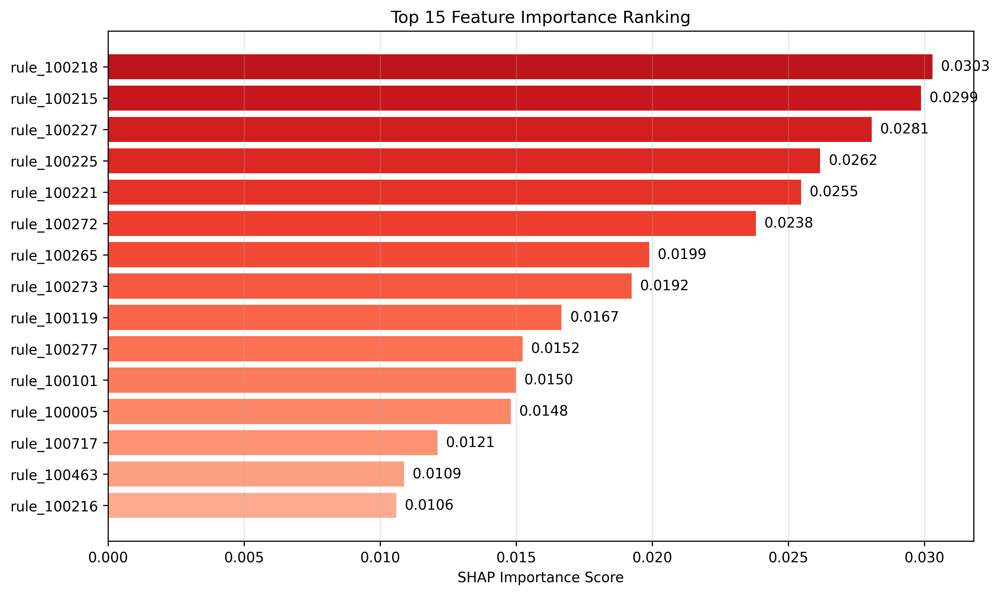
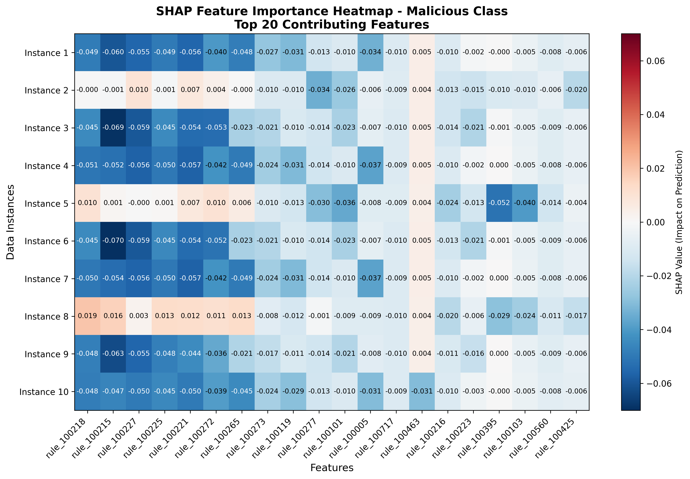

# SHAP Model Explanation Report

**Generated:** 2025-09-04 11:44:13
**Model Type:** RandomForestClassifier
**Samples Analyzed:** 50
**Total Features:** 742

## Model Predictions Summary

- **Prediction 0:** 22 samples (avg confidence: 84.98%)
- **Prediction 1:** 28 samples (avg confidence: 90.39%)

## Top Contributing Features

| Rank | Feature | Importance Score |
|------|---------|------------------|
| 1 | rule_100218 | 0.030295 |
| 2 | rule_100215 | 0.029867 |
| 3 | rule_100227 | 0.028059 |
| 4 | rule_100225 | 0.026169 |
| 5 | rule_100221 | 0.025467 |
| 6 | rule_100272 | 0.023808 |
| 7 | rule_100265 | 0.019888 |
| 8 | rule_100273 | 0.019245 |
| 9 | rule_100119 | 0.016666 |
| 10 | rule_100277 | 0.015230 |
| 11 | rule_100101 | 0.014989 |
| 12 | rule_100005 | 0.014803 |
| 13 | rule_100717 | 0.012113 |
| 14 | rule_100463 | 0.010876 |
| 15 | rule_100216 | 0.010593 |

## Key Findings

- **Most Critical Feature:** rule_100218
- **Highest Importance Score:** 0.0303
- **Analysis Scope:** Top 15 out of 742 total features

## Generated Visualizations

### Importance Plot

### Heatmap

## Technical Details

- **SHAP Analysis Timestamp:** 2025-09-04T11:44:10.638810
- **Background Data Shape:** (50, 742)
- **Feature Count:** 742
- **Samples Analyzed:** 50
