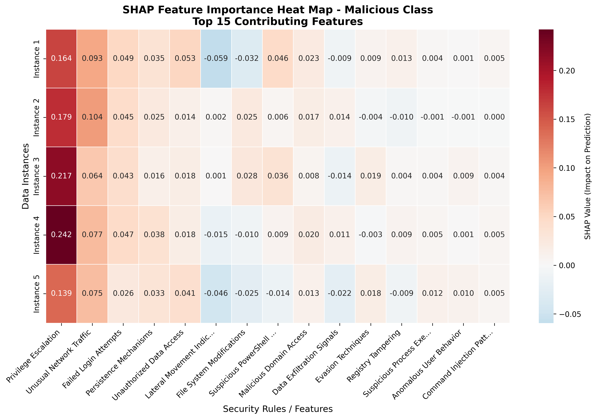
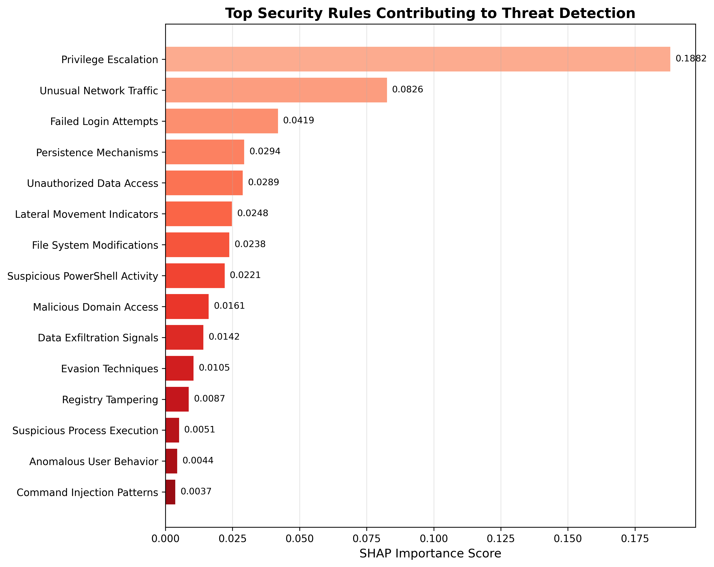

# SHAP Threat Detection Explanation Report

**Generated:** 2025-09-03 10:24:18
**Instances Analyzed:** 5
**Model Type:** RandomForestClassifier
**Total Features:** 15

## Model Predictions

### Instance 1
- **Prediction:** 1
- **Confidence:** 0.9000
- **Class Probabilities:** [0.1, 0.9]

### Instance 2
- **Prediction:** 1
- **Confidence:** 0.9200
- **Class Probabilities:** [0.08, 0.92]

### Instance 3
- **Prediction:** 1
- **Confidence:** 0.9600
- **Class Probabilities:** [0.04, 0.96]

### Instance 4
- **Prediction:** 1
- **Confidence:** 0.9600
- **Class Probabilities:** [0.04, 0.96]

### Instance 5
- **Prediction:** 1
- **Confidence:** 0.7600
- **Class Probabilities:** [0.24, 0.76]

## Visualizations

### SHAP Feature Importance Heat Map

The heat map shows how each security rule contributes to the threat detection for each analyzed instance. Red colors indicate positive contribution to malicious prediction, while blue indicates negative contribution.

### Feature Importance Ranking

This chart ranks the security rules by their overall importance in the threat detection decision.

## Top Contributing Security Rules

| Rank | Feature | Rule Description | Importance Score |
|------|---------|------------------|------------------|
| 1 | Security_Rule_05 | Privilege Escalation | 0.188202 |
| 2 | Security_Rule_02 | Unusual Network Traffic | 0.082592 |
| 3 | Security_Rule_03 | Failed Login Attempts | 0.041940 |
| 4 | Security_Rule_13 | Persistence Mechanisms | 0.029387 |
| 5 | Security_Rule_09 | Unauthorized Data Access | 0.028860 |
| 6 | Security_Rule_11 | Lateral Movement Indicators | 0.024803 |
| 7 | Security_Rule_04 | File System Modifications | 0.023842 |
| 8 | Security_Rule_08 | Suspicious PowerShell Activity | 0.022104 |
| 9 | Security_Rule_06 | Malicious Domain Access | 0.016134 |
| 10 | Security_Rule_12 | Data Exfiltration Signals | 0.014167 |
| 11 | Security_Rule_14 | Evasion Techniques | 0.010487 |
| 12 | Security_Rule_07 | Registry Tampering | 0.008686 |
| 13 | Security_Rule_01 | Suspicious Process Execution | 0.005063 |
| 14 | Security_Rule_15 | Anomalous User Behavior | 0.004392 |
| 15 | Security_Rule_10 | Command Injection Patterns | 0.003686 |

## Key Findings

- **Most Critical Rule:** Privilege Escalation (importance: 0.1882)
- **Analysis Scope:** Top 15 out of 15 total features
- **Detection Confidence:** 96.0%

## Analysis Notes

- **Importance Scores:** Higher values indicate features that contributed more to the malicious prediction
- **Security Rules:** Each feature represents a security rule or detection pattern
- **Threat Analysis:** Review the top contributing rules for threat hunting and rule refinement
- **Model Explainability:** SHAP values provide local explanations for individual predictions

## Technical Details

- **SHAP Library Version:** 0.41.0
- **Background Data Size:** 100 instances
- **Feature Count:** 15
- **Analysis Timestamp:** 2025-09-03T10:24:18.824275
